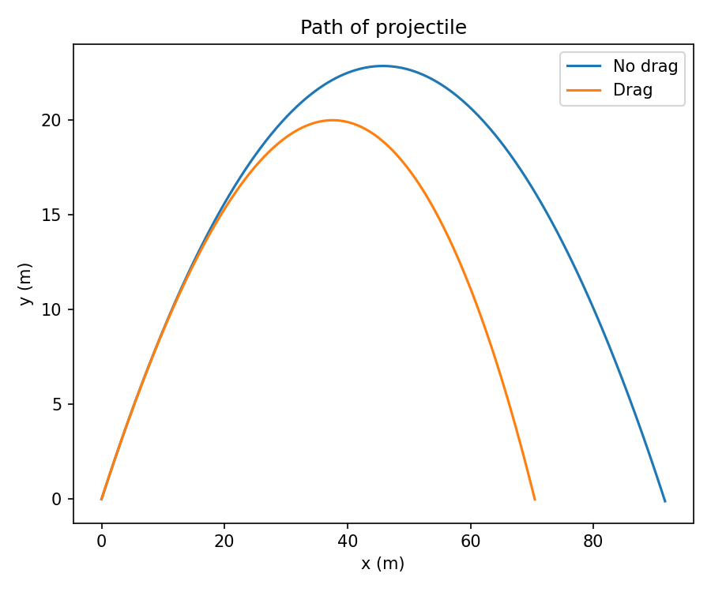
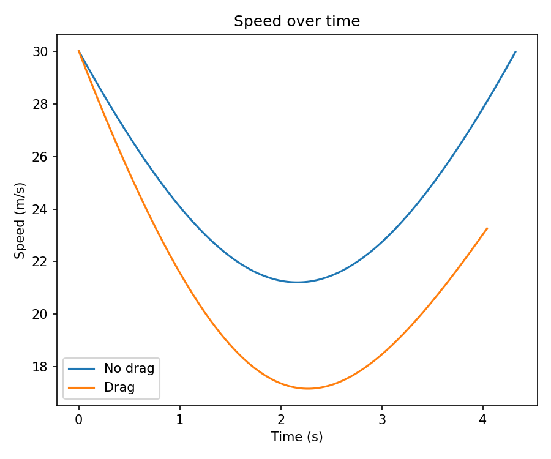

# Projectile Motion Simulator with Aerodynamic Drag
### Python & NumPy | Classical Mechanics | Numerical Integration

---

## Overview

This project simulates projectile motion under two conditions:
- **Ideal case** — no air resistance
- **Realistic case** — with aerodynamic drag

Built from scratch using NumPy and Matplotlib. No physics libraries used — just Newton's second law applied step by step using numerical integration.

---

## Physics

Without drag, acceleration is constant:
- ax = 0
- ay = -g

With aerodynamic drag, the drag force opposes motion:
- ax = -(k/m) x vx
- ay = -g - (k/m) x vy

Since acceleration depends on current velocity (which changes every step), no closed-form solution exists. The trajectory is computed iteratively using a while loop with dt = 0.01s time steps.

---

## Results

| Parameter     | No Drag   | With Drag | Loss  |
|---------------|-----------|-----------|-------|
| Max height    | 22.83 m   | 19.97 m   | 12.5% |
| Range         | 91.64 m   | 70.46 m   | 23%   |

Drag reduces range significantly more than height — because horizontal drag acts throughout the entire flight, while vertical drag partially counteracts gravity on the way up.

---

## Plots

### Trajectory Comparison

### Speed Over Time

---

## Tech Stack

| Tool       | Purpose                        |
|------------|-------------------------------|
| Python 3   | Core language                  |
| NumPy      | Vectorized math, while loop    |
| Matplotlib | Dual trajectory plot           |

---

## How to Run

pip install numpy matplotlib
python projectile_drag.py

---

## Author

Drew — First Year B.Tech Mechanical Engineering, MSU Baroda
